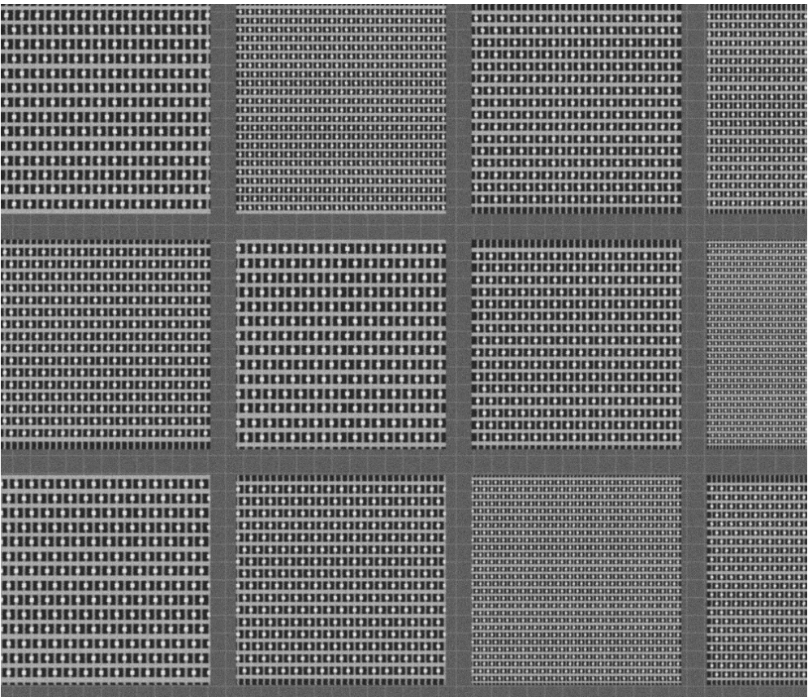
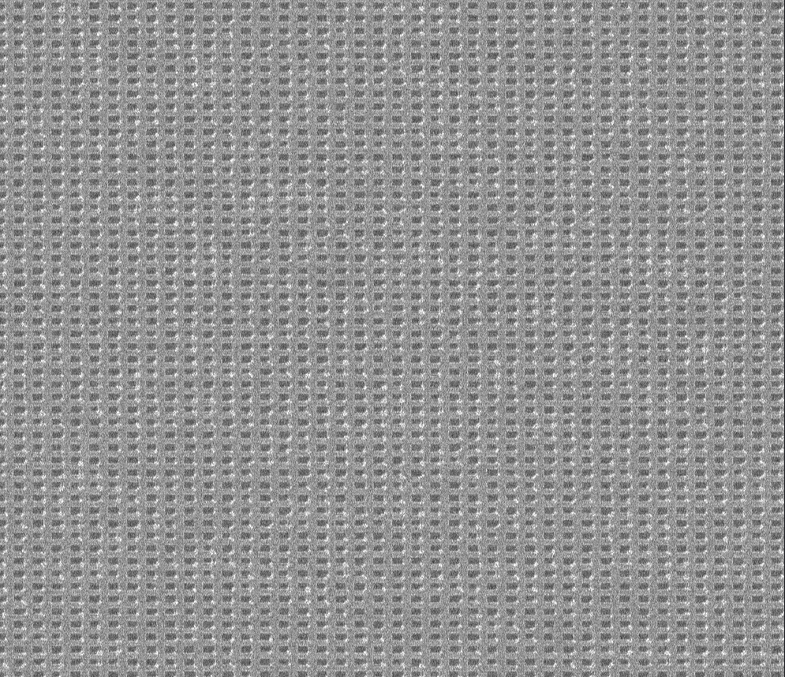
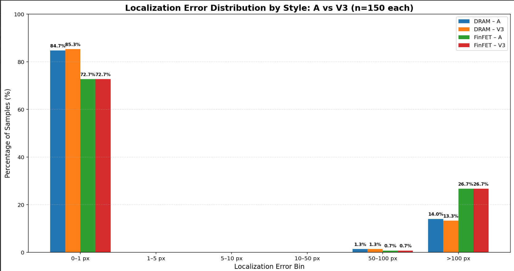
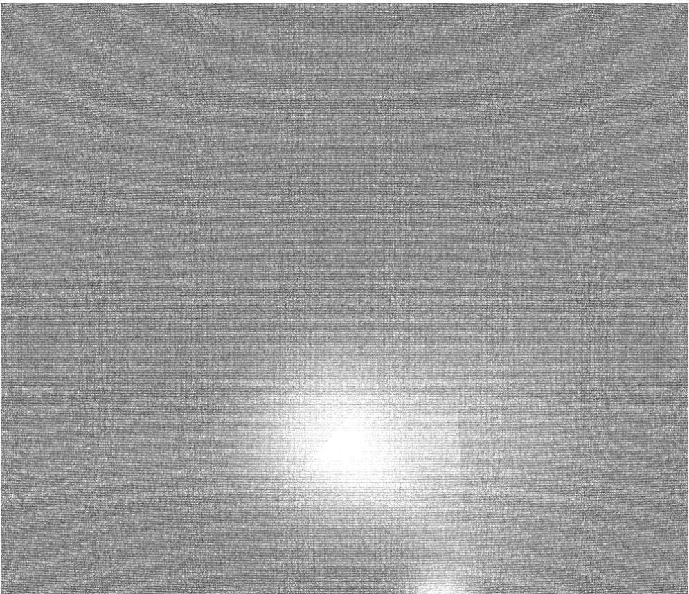
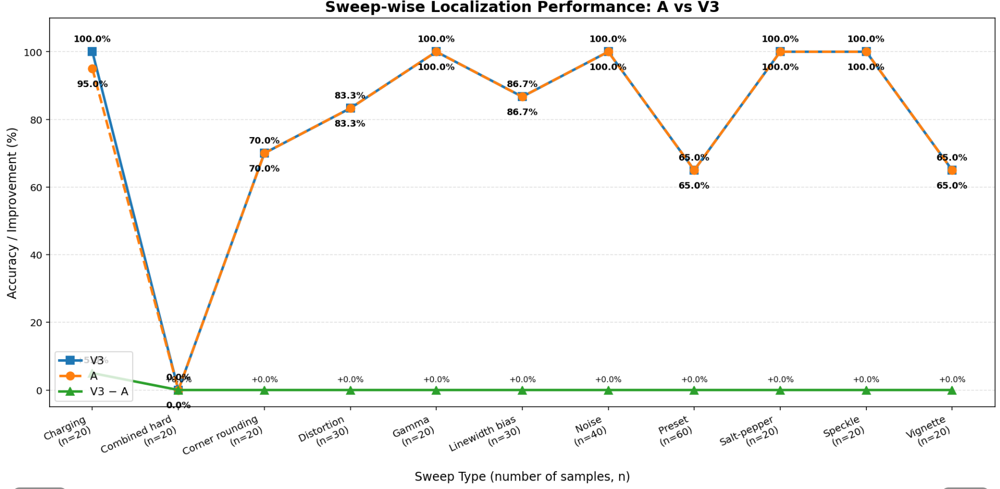
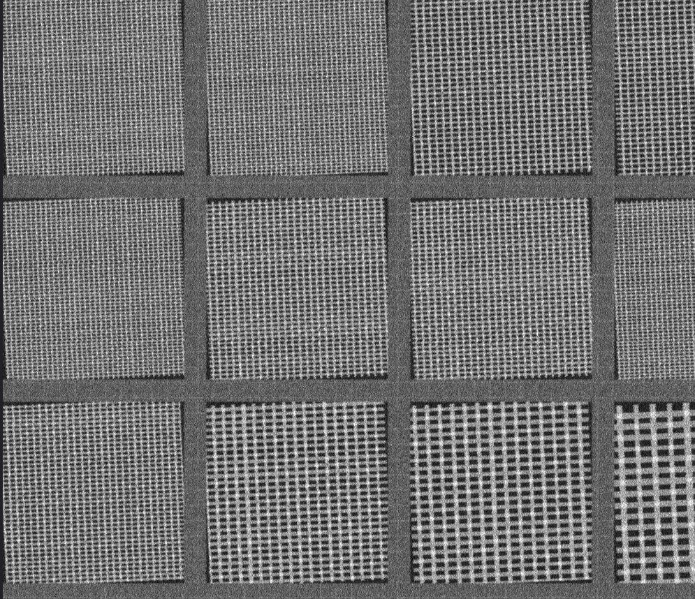

In SEM wafer inspection, absolute brightness encodes critical information about material composition and voltage contrast which ZNCC inadvertently erases by subtracting the local mean. Furthermore, ZNCC heavily amplifies random shot noise in flat, unpatterned wafer regions, whereas NCC properly suppresses these areas by scaling with raw image energy. This makes NCC highly stable and precise under the strictly controlled, non-optical illumination of an electron microscope.

# NCC + ML

A hybrid image-localization pipeline combining **Normalized Cross-Correlation (NCC)** with a trained **V3 machine-learning ranker** for semiconductor/DRAM pattern localization.

In this repository, **V3** refers to the ML-based candidate ranking stage built on top of NCC-derived features.

## Pipeline

```text
Reference + Search Image
          │
          ▼
     NCC Candidate
     Generation
          │
          ▼
   Feature Extraction
          │
          ▼
       V3 Ranker
          │
          ▼
    Final Prediction
```

What is V3?

V3 is the machine-learning candidate-ranking stage of the localization pipeline. NCC first produces a set of candidate matches and associated image features; V3 learns how to rank those candidates rather than relying only on the raw NCC score.

The ranker uses 11 features derived from the NCC candidate set, including NCC score, candidate rank, score gap, local curvature, symmetry, anisotropy, basin width, normalized center distance, candidate-count information, and the additional scale_score_std feature.

The model is trained as a listwise ranker, where candidates belonging to the same reference/search pair are evaluated against each other and the model learns to place the ground-truth candidate above competing candidates.

## Running the Benchmark

The trained V3 model is located in:

```text
./hybrid_ncc_ml_model_weights/
```

To Run the code use

```bash
python3 benchmark_v3.py \
    --dataset-dir ./output/dram30/train/ \
    --model ./hybrid_ncc_ml_model_weights/ranker_v3.pt \
    --config ./hybrid_ncc_ml_model_weights/ranker_v3_config.json \
    --tolerance 5.0 \
    --method V3
```

And run for plots 


### Parameters

| Parameter       | Description                                              |
| --------------- | -------------------------------------------------------- |
| `--dataset-dir` | Dataset containing the reference/search pairs            |
| `--model`       | Trained V3 model weights                                 |
| `--config`      | V3 model configuration and normalization parameters      |
| `--tolerance`   | Maximum localization error considered correct, in pixels |
| `--method V3`   | Runs the V3 ML ranker                                    |

## Benchmark Dataset

The current benchmark contains **30 DRAM pairs**.

Correct localization is defined using a **5.0 px tolerance**.

## Results — V3 Only

```text
Pairs       : 30
Tolerance   : 5.00px
Accuracy    : 83.33%
Mean error  : 22.79px
Median error: 0.65px
Max error   : 232.02px
Mean time   : 376.58 ms/pair
Median time : 374.28 ms/pair
Max time    : 396.17 ms/pair
Mean score  : 0.004887
Median score: 0.004149
```

### Accuracy by Style

| Style | Samples | Accuracy |
| ----- | ------: | -------: |
| DRAM  |      30 |   83.33% |

### Error Distribution

| Error range | Samples | Percentage |
| ----------- | ------: | ---------: |
| 0–1 px      |      20 |     66.67% |
| 1–5 px      |       5 |     16.67% |
| 5–10 px     |       0 |      0.00% |
| 10–50 px    |       0 |      0.00% |
| 50–100 px   |       1 |      3.33% |
| >100 px     |       4 |     13.33% |

The benchmark therefore achieves **83.33% localization accuracy within 5 px**, with **25/30 predictions within 5 px** of the ground-truth location.

```bash
python plot.py --csv benchmark_results.csv
```
[SKIP] PR curve for noise=finfet_14nm: no positive samples.
[OK]   plots/01_pr_curve_by_noise.png
[OK]   plots/02_baseline_score_by_noise.png
[OK]   plots/03_v3_error_distribution.png
[OK]   plots/04_error_vs_baseline_score.png
[OK]   plots/05_accuracy_by_noise.png
[OK]   plots/06_runtime_by_noise.png
[OK]   plots/07_spatial_error_vectors.png
[SKIP] Missing columns: polygon_rotation_deg
[SKIP] Missing columns: architecture

Dataset

The benchmark dataset is located at:

output/dram30/train/

The 30-pair benchmark covers 6 different DRAM layout architectures, with 5 samples per architecture, providing architectural diversity rather than evaluating the model on repeated instances of a single layout.

Architecture	Samples
dram_1x	5
dram_dense	5
dram_loose	5
dram_wide	5
dram_compact	5
dram_legacy	5

Each architecture is evaluated across four polygon-generation rotation conditions:

{0°, 1.5°, 2.5°, 3.0°}

Thus, the benchmark specifically tests whether the NCC + V3 pipeline remains effective across different DRAM layout geometries and small layout-level rotation variations.

### Failure cases 
1. FinFET patterns, in case smaller dies/design,  create multiple visually similar NCC peaks.
This causes false spatial locks, where the predicted location can be hundreds of pixels from GT.
In our candidate-generation test, Recall@100 = 0% on the tested difficult set — the GT wasn't even present among the top 100 NCC candidates.

Practically in certain process inspection after the CMP fills the die margin pitchs would'nt be clearly visisble as in above image, it might look like something similar as in below ones





2. Effects such as charging, dose/noise, and other appearance changes occurring together can substantially degrade matching.

Performance collapsed to:
DRAM: 23.9%
FinFET: 2.9%
Overall: 11.4%




3. Polygon rotation reduce the over accuracy from 80 ish to 66 percent, added with noises (edge rounding) lead to 0% accuracy


### V3 Training Datasets

V3 was trained and evaluated across progressively more challenging synthetic datasets, each created to isolate a specific failure mode of NCC-based localization.

| Dataset           | Purpose                                                                                                         |  DRAM | FinFET |   Overall |
| ----------------- | --------------------------------------------------------------------------------------------------------------- | ----: | -----: | --------: |
| **Author**        | Baseline dataset representing the original image-generation conditions.                                         | 82.0% |  65.0% | **74.4%** |
| **Centre Bias**   | Tests the effect of spatial distribution / centre-biased placement of targets.                                  | 75.3% |  68.9% | **72.9%** |
| **Full Ablation**   | Sweeps the relevant image-generation factors to determine where the localization pipeline begins to break down.             | 78.7% |  43.6% | **63.8%** |
| **Confounded**  |Tests robustness when charging and other image variations are confounded together in the same image. | 23.9% |   2.9% | **11.4%** |

> **A = baseline NCC method; V3 = NCC + ML ranker.**

The datasets were deliberately separated to distinguish **normal performance**, **spatial-prior effects**, **confounded imaging effects**, and **systematic failure limits** rather than treating all degradation as a single problem.

## Project Scope

This repository currently focuses on the **NCC + V3 ML localization pipeline** and its benchmark evaluation.

* **NCC** provides candidate localization/features.
* **V3** performs ML-based candidate ranking.
* The benchmark evaluates the final predicted location against the ground truth using pixel error.


